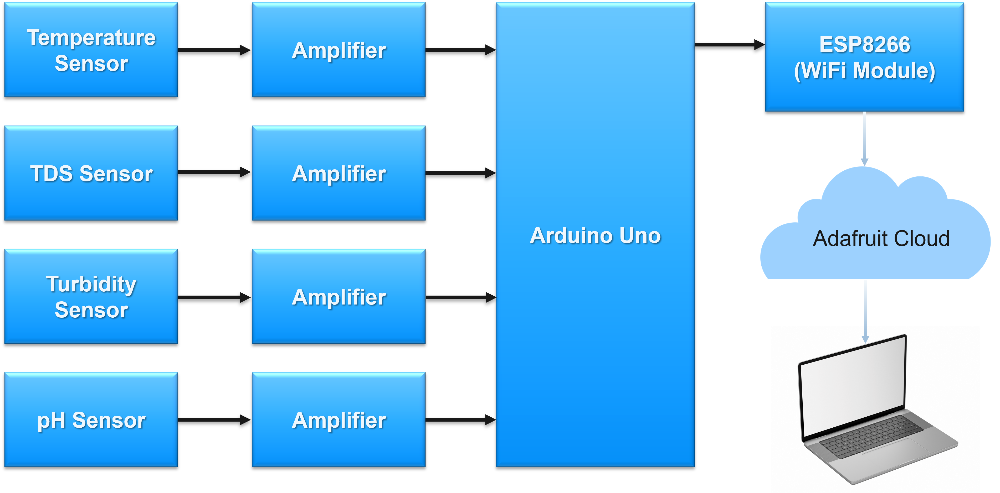
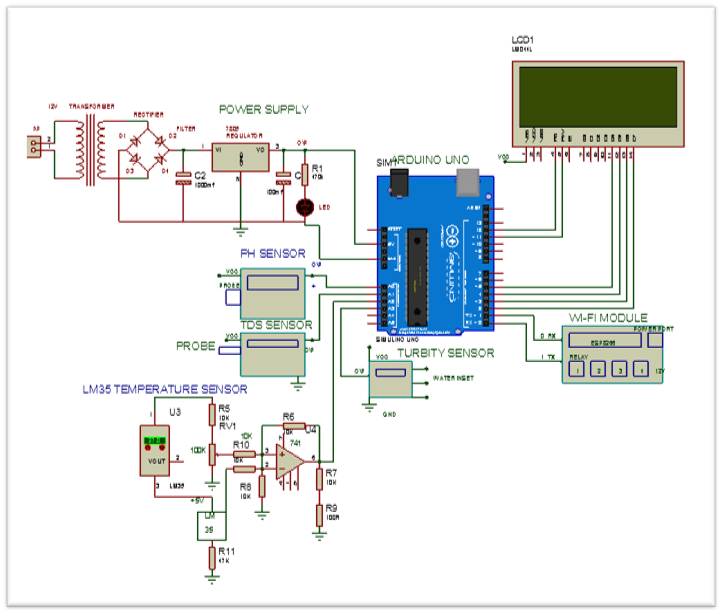
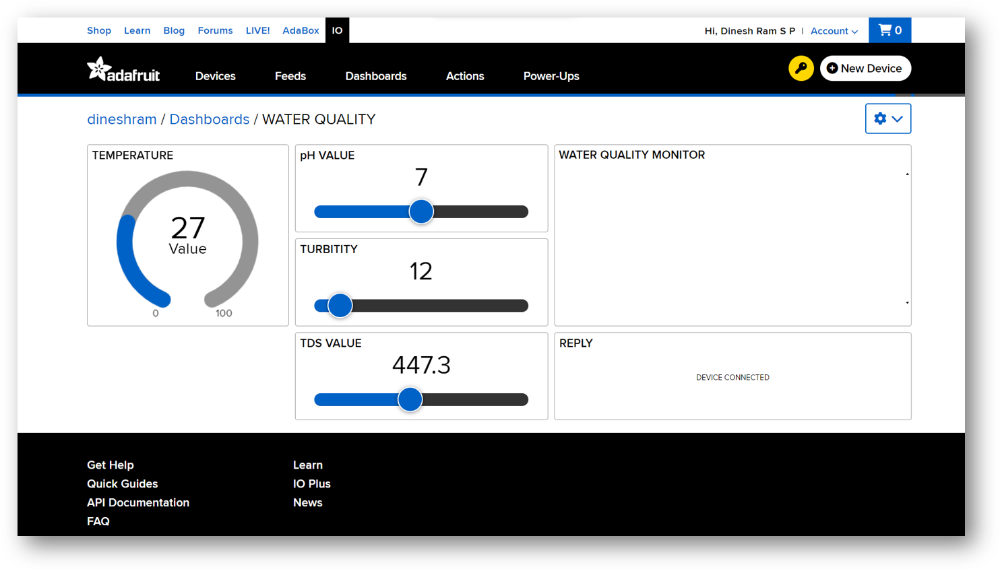
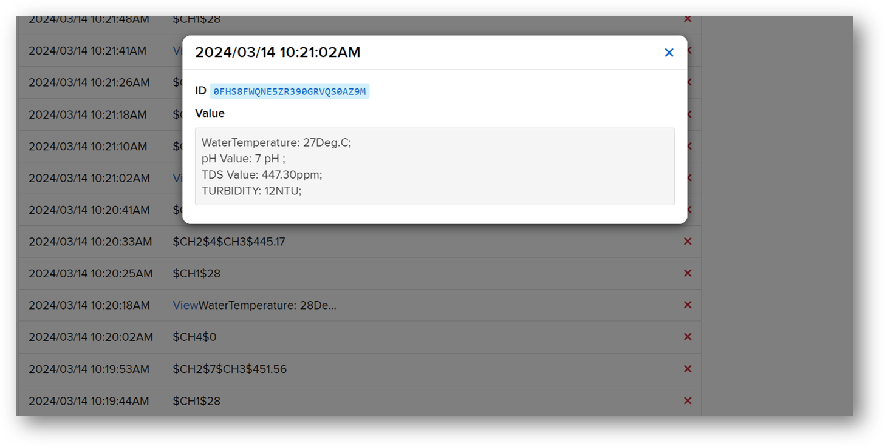
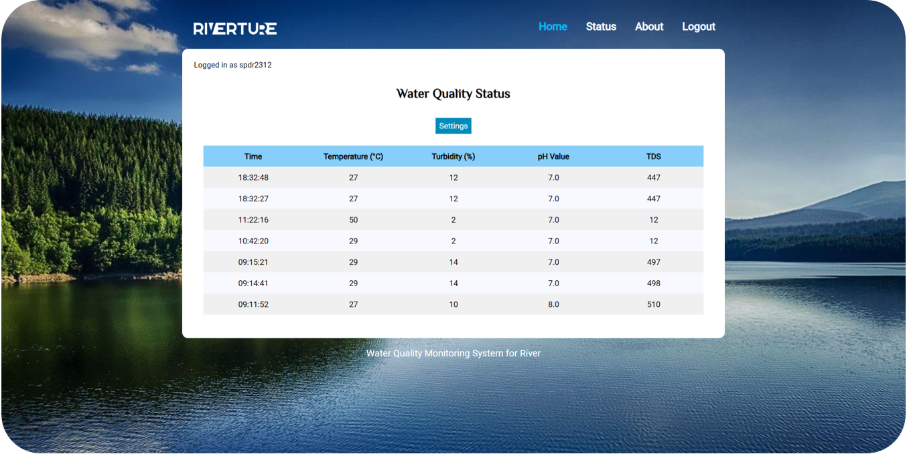
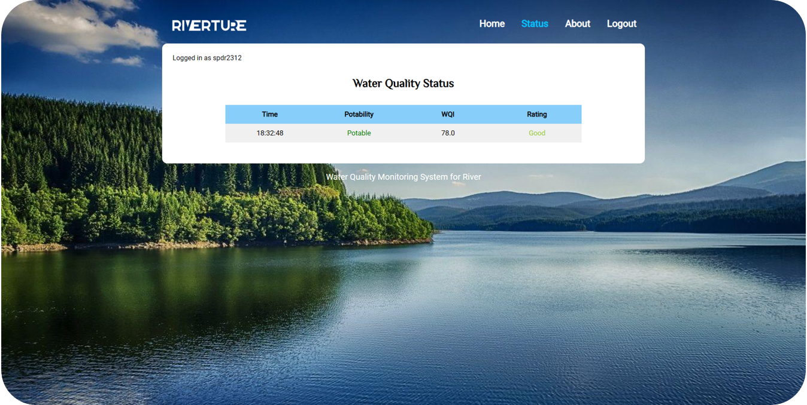
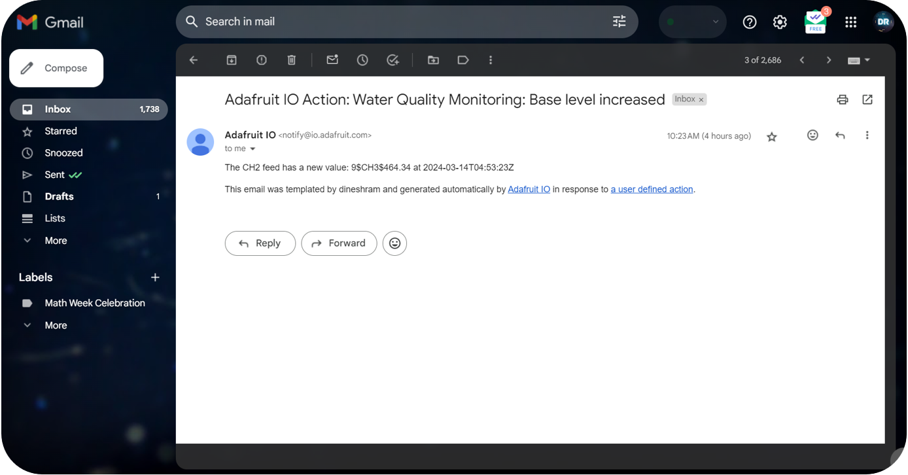

# Development_of_Smart_Water_IoT_System_to_Assess_and-Monitor_the_Quality_of_River_Water

Website of water quality monitoring system using Arduino, C, PHP, AngularJS and Python.

A part of UG final year project


## Project Requirements:
* Arduino 
    * Arduino board files
    
* Python 3 - _**Python 3.6.0** is used in this project_
    * Python ```requests``` package [Official Site](http://docs.python-requests.org/en/v2.7.0/user/install/)
    * Python ```pyserial``` package [Official Site](https://pyserial.readthedocs.io/en/latest/pyserial.html)
    
* PHP - _**PHP 7.2.10** is used in this project_

* SQL Database Server - _Read ```sql.txt``` and ```sql2.txt``` for database and table setup_

* Hardware Components
    * ESP8266 (WiFi Module)
    * Arduino Uno
    * Turbidity Sensor
    * Temperature Sensor
    * pH Sensor
    * TDS Sensor
    * LCD Display


## Getting Started
** _Configure project website settings in ```config.php``` file_

** _Configure arduino **serial port** and **website host address** in ```serialread.py``` file_

** _Run/Open ```serialread.py```_


## Block Diagram



## Proposed Circuit Diagram




## Dataset
* **Features:** pH, Temperature, Solids, Turbidity
* **Target:** Potability
* **No. of Rows:** 3277

[Reference](https://www.kaggle.com/datasets/uom190346a/water-quality-and-potability)

## Result







